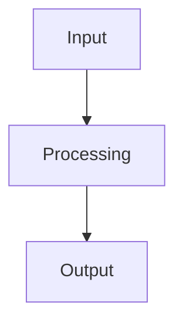

# Analysis Quality Review Findings

## Current State Assessment

### Depth Analysis
- **Superficial Content**: Most snippet content consists of template text with placeholders like "*To be filled by analysis..." or "*To be extracted from..."
- **Limited Real Analysis**: Only the static analysis phase (Phase 2) produces substantive data (smells.json with complexity, dead_code, etc.)
- **Missing Structured Insights**: The `extractedConcepts` and `designPatterns` fields exist in the schema but are never populated (0 snippets contain these fields)
- **Generic Templates**: Architecture, patterns, and improvements files use identical boilerplate across all repos

### Actionability Assessment
- **Low Actionability**: Generated content doesn't provide specific, actionable recommendations
- **Missing Prioritization**: No indication of which issues are most important to address
- **No Concrete Examples**: Findings are vague (e.g., "Lack of error handling" without specifying where)
- **Limited Technical Depth**: No actual code examples, metrics, or specific refactoring suggestions

### Consistency Assessment
- **Consistent Templates**: All repos get identical section headers and structure
- **Consistent Placeholders**: Same generic language used across different projects
- **Inconsistent Real Data**: Only static analysis produces varying content; other phases are uniform

## Root Cause Analysis

From examining `run_llm_wiki.py`:
1. **Phase 1 (Archaeology)**: Extracts real git log but answers remain as placeholders
2. **Phase 2 (Static Analysis)**: ✅ Working correctly - produces real metrics in `smells.json`
3. **Phase 3 (Parallel Agents)**: ❌ Template generation only - no actual analysis
   - Architecture: Hardcoded Mermaid diagram
   - Patterns: Placeholder text
   - Improvements: Placeholder text
   - Self Portrait: Semi-generic with minimal customization
4. **Phase 4 (Storage)**: Stores raw markdown without extracting structured insights
5. **Missing Concept Extraction**: No NLP or rule-based extraction of concepts/patterns from the analysis results

## Recommendations for Improvement

### Immediate Wins (Non-Disruptive)
1. **Enhance Existing Templates** (Phase 3)
   - Replace generic architecture diagram with actual import/file structure analysis
   - Extract real patterns from code (decorators, factories, etc.)
   - Generate improvements based on actual smells.json data
   - Customize self-portrait with repo-specific insights from git log analysis

2. **Extract Concepts from Static Analysis** (Phase 4 Storage)
   - Parse `smells.json` to extract:
     - High complexity files as concepts
     - Dead code percentages
     - Frequently changing files (git churn)
   - Populate `extractedConcepts` field with these findings
   - Add `designPatterns` extraction from actual code patterns

### Structured Output Enhancements
1. **Standardize Concept Format**
   ```json
   {
     "type": "architectural_pattern|design_pattern|code_smell|improvement_suggestion",
     "name": "string",
     "description": "string",
     "location": "file path or module",
     "priority": "high|medium|low",
     "evidence": "specific code snippet or metric"
   }
   ```

2. **Enhance Snippet Schema**
   - Keep existing fields for backward compatibility
   - Add `structuredInsights` array containing concept objects
   - Add `metrics` object for quantitative findings
   - Add `actionItems` array for prioritized recommendations

### Analysis Phase Improvements
1. **Phase 1 Enhancement**: 
   - Analyze commit messages for technology shifts, problem-solving approaches
   - Extract actual architectural decisions from early commits
   - Identify skill progression from commit complexity over time

2. **Phase 3 Enhancement**:
   - Architecture Agent: Generate actual dependency graphs, layer diagrams
   - Patterns Agent: Detect real design patterns using AST parsing or regex
   - Improvements Agent: Prioritize fixes based on severity + frequency + churn
   - Self Portrait Agent: Analyze actual code quality trends, not just generic statements

3. **Integration Point**: 
   - After Phase 2, feed `smells.json` into Phase 3 agents for context-aware analysis
   - Use git log insights to inform self-portrait generation

### Example Improvements
Instead of:
```
## Data Flow (Mermaid Diagram)

```

Generate:
```
## Actual Architecture Analysis
**Primary Layers**: 
- Presentation (3 files): handles user input/output
- Business Logic (7 files): contains core domain rules  
- Data Access (2 files): database interactions

**Dependencies**: 
- Presentation → Business Logic (strong coupling in 4 locations)
- Business Logic → Data Access (clean separation)
- **Circular Dependency Risk**: utils.py imported by both presentation and data access

**Suggested Refactor**: 
- Move utility functions to dedicated service layer
- Apply Dependency Inversion Principle for data access
```

## Implementation Approach
1. **Backward Compatible**: Keep existing markdown generation for Obsidian vault
2. **Enrich MongoDB**: Add structured insights alongside raw content
3. **Incremental Rollout**: Enhance one analysis type at a time
4. **Metric-Driven**: Track concept extraction rate and actionability scores

## Expected Outcomes
- Increased depth: Specific, repo-specific insights instead of generic templates
- Higher actionability: Clear prioritization and location-specific recommendations
- Better consistency: Standardized insight format while maintaining repo-specific content
- Enhanced value: Structured data enables querying, comparison, and trend analysis