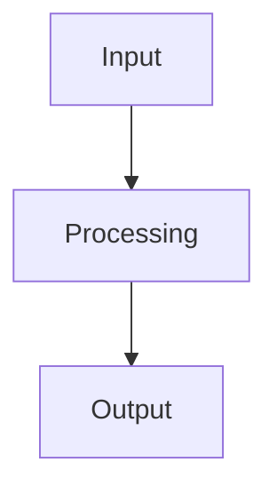

# Architecture for PocketFlow-Tutorial-Codebase-Knowledge

## Data Flow (Mermaid Diagram)

```mermaid
graph TD
    A[Input] --> B[Processing]
    B --> C[Output]
```
*To be generated from import graph and file tree.